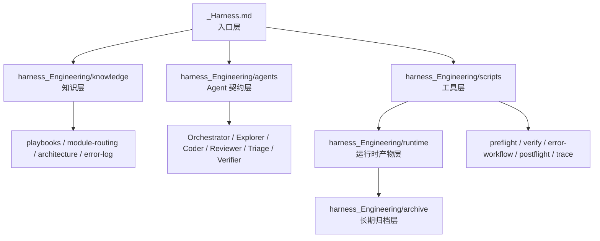
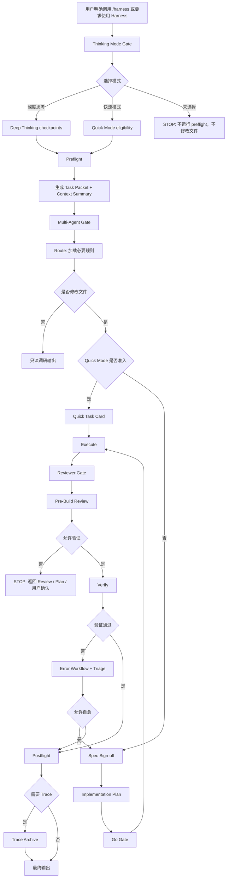
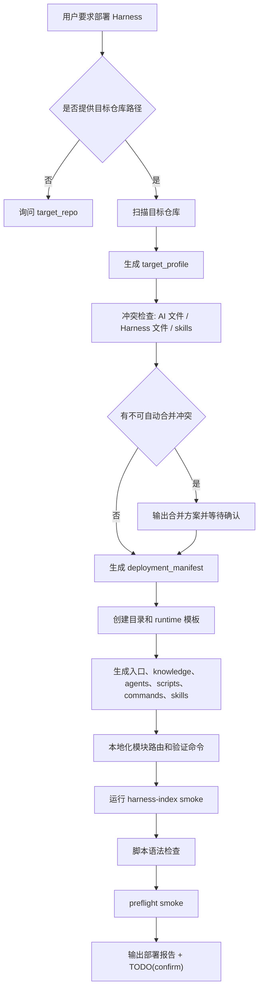
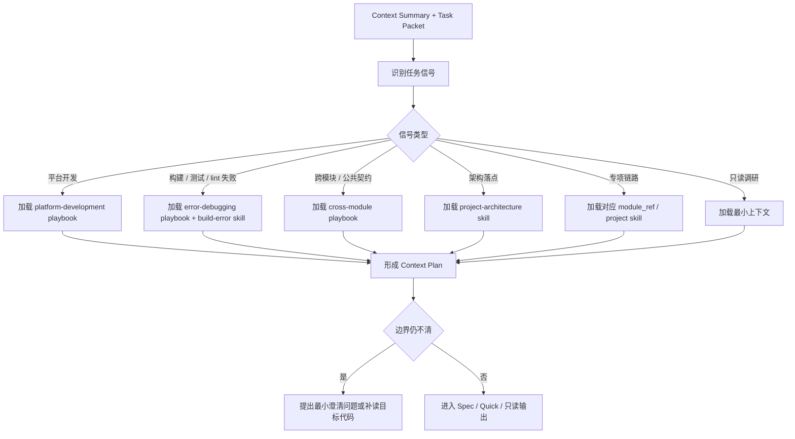
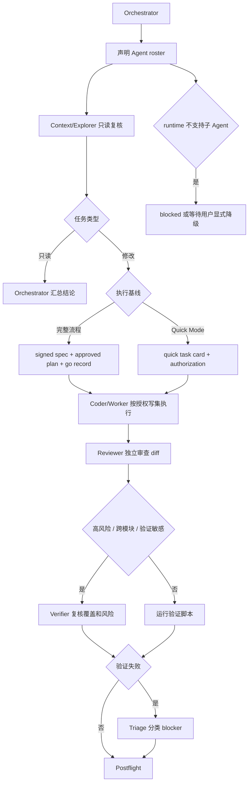
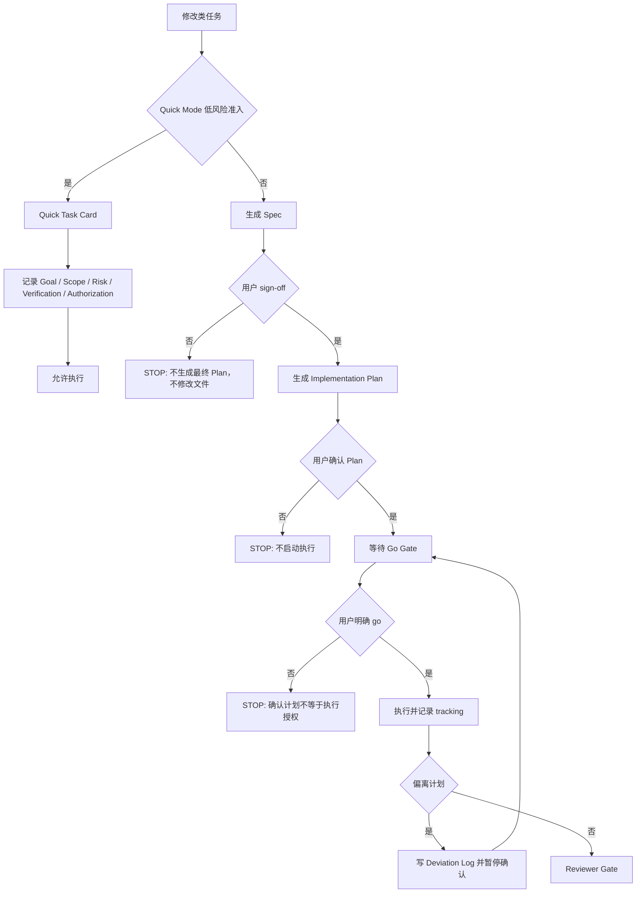
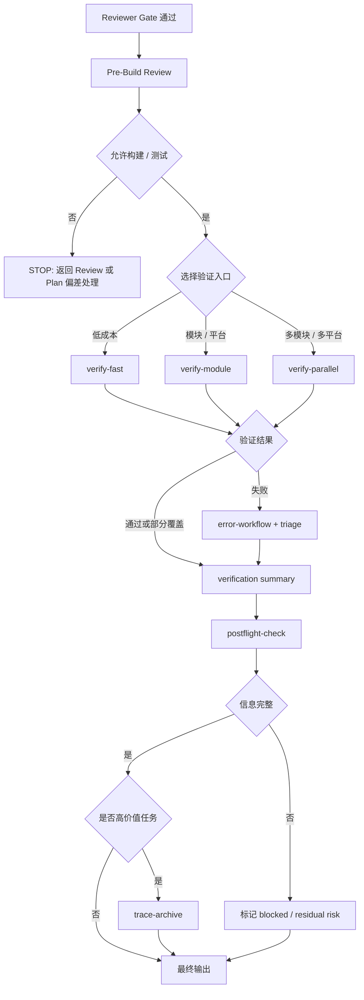
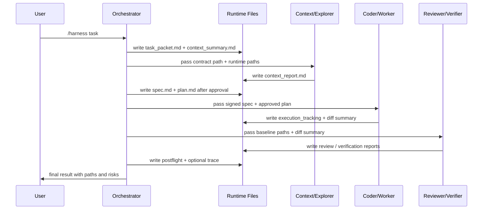

# Harness 框架部署器

## Pattern

- ADK 5-pattern tags: `Generator` + `Pipeline` + `Reviewer` + `Inversion` + `Tool Wrapper`
- `Generator`：生成 Harness 目录、入口文档、脚本、runtime 模板和项目 skills。
- `Pipeline`：强制按 discovery、画像、生成、验证、交付的顺序执行。
- `Reviewer`：用 gate 和 checklist 检查是否误套业务、误造命令、遗漏验证。
- `Inversion`：先识别目标仓库技术栈和工程语言，再生成本地规则。
- `Tool Wrapper`：把 build/test/lint、git diff、文件扫描等外部能力包装成固定 Harness 入口。

## Goal

在任意客户端仓库中部署一套自包含的 Harness 工作流框架，让 AI 处理需求、修复、评审和验证时有统一入口、统一上下文、统一门禁、统一产物和统一收口。

“一键部署”在本 skill 中的含义是：AI 读取目标仓库后，按本文件内置蓝图直接生成可运行的 Harness skeleton、入口文档、最小脚本、runtime 模板和项目技能；不要求目标仓库已经有 Harness，也不要求访问某个私有参考仓库。

## Input Contract

- 目标仓库路径；用户要求实际写入但没给路径时，先问目标仓库在哪里。
- 部署模式：`plan_only`、`skeleton`、`full`、`audit`。
- 目标 AI runtime：Codex、Claude、自定义 Agent、shell-only、未知或混合。
- 可选偏好：Harness 名称、是否启用多 Agent、是否生成 project skills、是否生成 shell 脚本、是否接入 CI。

## Output Contract

- 目标仓库画像：技术栈、模块、入口、公共层、业务词、构建/测试/lint 命令、已有 AI 文件。
- Harness 部署计划：新建、更新、跳过、冲突四类文件。
- 生成的 Harness 文件：入口、knowledge、agents、scripts、runtime、archive、commands、skills。
- smoke 验证结果。
- `TODO(confirm)` 列表、未覆盖项和残余风险。

## Scope Boundary

- 本技能不依赖任何私有 Harness 仓库，也不要求读取某个固定项目作为参考。
- 本技能不替目标仓库发明业务事实、构建命令或代码规范。
- 本技能部署框架和流程，不直接完成目标仓库的业务需求。

## Harness Core

Harness 是一层 AI 工程操作系统，放在业务代码旁边，但不替代业务代码。它负责：

- 任务入口：判断什么时候进入 Harness。
- 上下文收敛：把任务、路径、模块、风险、规则和验证建议写进 Task Packet。
- 工作流门禁：在修改前要求 Spec / Plan / Go，在完成前要求 Review / Verify / Postflight。
- 角色协作：用 Agent 契约限定 Orchestrator、Explorer、Coder、Reviewer、Triage、Verifier 的输入输出。
- 验证闭环：把构建、测试、lint、截图、人工阻塞等统一写成可审计产物。
- 经验沉淀：把高价值任务归档为 trace，把稳定错误规则沉淀到知识层。

## Flow Diagrams

以下流程图是 Harness 框架的通用蓝图。部署到目标仓库时，只替换技术栈、模块名、验证命令和项目 skill，不改变 gate 顺序。

### 1. Harness 分层架构



### 2. 主工作流



### 3. 一键部署流程



### 4. Route 路由流程



### 5. 多 Agent 编排



### 6. Spec / Plan / Go 授权



### 7. 验证 / Postflight / Trace



### 8. 文件化通信协议



## Target Discovery

部署前先生成 `target_profile`，所有本地化规则都必须来自它。

```text
repo_name:
client_family:
platforms:
build_systems:
package_managers:
entrypoints:
module_patterns:
module_names:
common_layers:
domain_keywords:
high_risk_chains:
source_sets:
build_commands:
test_commands:
lint_commands:
style_conventions:
existing_ai_files:
existing_harness_files:
confidence:
```

常见识别信号：

- Android：`settings.gradle`、`build.gradle`、`build.gradle.kts`、`gradlew`、`AndroidManifest.xml`、`app/src/main`、Kotlin/Java。
- iOS：`.xcodeproj`、`.xcworkspace`、`Podfile`、`Package.swift`、`Info.plist`、Swift/Objective-C。
- HarmonyOS：`build-profile.json5`、`oh-package.json5`、`hvigorfile.ts`、`module.json5`、ArkTS `.ets`。
- Flutter：`pubspec.yaml`、`lib/`、`android/`、`ios/`、`test/`。
- React Native：`package.json`、`metro.config.js`、`android/`、`ios/`、TypeScript/JavaScript 入口。
- Web：`package.json`、`vite.config.*`、`next.config.*`、`src/`、Playwright/Cypress/Vitest/Jest 配置。
- 小程序：`app.json`、`project.config.json`、页面/组件配置。
- 混合仓库：多个端信号并存，Harness 放工作区根目录，并按平台路由。

## Default Directory

完整部署时生成以下结构；按目标 runtime 删除不可用入口。

```text
target-repo/
├── <repo>_Harness.md
├── harness_Engineering/
│   ├── README.md
│   ├── DECISIONS.md
│   ├── knowledge/
│   │   ├── README.md
│   │   ├── architecture.md
│   │   ├── module-routing.md
│   │   ├── deep-thinking-mode.md
│   │   ├── quick-mode.md
│   │   ├── spec-plan-go.md
│   │   ├── multi-agent-patterns.md
│   │   ├── error-log.md
│   │   ├── playbooks/
│   │   │   ├── 00-governance.md
│   │   │   ├── 05-platform-development.md
│   │   │   ├── 06-error-debugging.md
│   │   │   └── 90-cross-module.md
│   │   └── module_refs/
│   ├── agents/
│   │   ├── README.md
│   │   ├── orchestrator.md
│   │   ├── context-explorer-agent.md
│   │   ├── coder-agent.md
│   │   ├── reviewer-agent.md
│   │   ├── triage-agent.md
│   │   └── verifier-agent.md
│   ├── scripts/
│   │   ├── README.md
│   │   ├── harness-index.sh
│   │   ├── preflight-context.sh
│   │   ├── changed-modules.sh
│   │   ├── prebuild-review.sh
│   │   ├── verify-fast.sh
│   │   ├── verify-module.sh
│   │   ├── verify-parallel.sh
│   │   ├── error-workflow.sh
│   │   ├── postflight-check.sh
│   │   ├── trace-archive.sh
│   │   └── templates/
│   ├── runtime/
│   │   ├── .gitignore
│   │   ├── README.md
│   │   ├── task_packets/
│   │   ├── specs/
│   │   ├── implementation_plans/
│   │   ├── triage/
│   │   ├── verification/
│   │   └── postflight/
│   └── archive/
│       ├── traces/
│       └── benchmarks/
├── AGENTS.md
├── .codex/commands/harness.md
├── .codex/skills/<repo>-harness/SKILL.md
└── skills/<repo>-.../SKILL.md
```

## Generated File Contracts

### `<repo>_Harness.md`

必须包含：

- 一句话定位：这是目标仓库的 AI 工作流入口。
- 显式触发规则：只有用户调用 `/harness` 或明确说使用 Harness 时才进入。
- 当前仓库架构总览：由 `target_profile` 生成，不写没有证据的业务事实。
- 默认阅读顺序：入口 -> context summary -> task packet -> 命中 playbook / skill。
- 完整工作流：Thinking Mode -> Preflight -> Agent Gate -> Route -> Spec -> Plan -> Go -> Execute -> Review -> Prebuild -> Verify -> Postflight -> Trace。
- 输出要求：模式选择、命中模块、启用角色、产物路径、验证结果、假设、未覆盖项、风险。

### `AGENTS.md`

只登记真实存在的 project skills 和 command。必须说明：

- Harness 的触发条件。
- 多 Agent 不可用时是否阻塞，或如何显式降级。
- 不要把普通需求自动升级为 Harness，除非用户明确要求。
- 项目 skills 的加载位置。

### `.codex/commands/harness.md`

必须薄：只说明 `/harness` 如何调用索引和路由。命令清单以 `harness-index.sh` 为准，避免维护两份索引。

### Agent 契约

每个 Agent 文件使用同一结构：

```text
# <Role> 契约
## 角色定位
## 输入
## 输出
## 上下文装载
  - MUST
  - OPTIONAL
  - FORBIDDEN
## 允许动作
## 禁止动作
## 汇报格式
```

基础角色：

- Orchestrator：控制 gate、汇总产物、对用户沟通；不直接替代 Reviewer。
- Context/Explorer：只读探索仓库，输出模块、风险、上下文建议；不得改文件。
- Coder/Worker：只在 Spec / Plan / Go 通过后修改文件；必须记录偏离。
- Reviewer：审查 diff 是否符合已授权基线；优先报告问题。
- Triage：处理构建、测试、类型、静态检查错误；判断是否可自愈。
- Verifier：复核验证范围、命令、未覆盖项和残余风险。

### Knowledge 文件

- `architecture.md`：目标仓库分层、模块关系、依赖方向。
- `module-routing.md`：任务信号 -> 模块 -> playbook -> skill -> 验证命令。
- `deep-thinking-mode.md`：在需求不清、方案分叉、风险高时插入追问。
- `quick-mode.md`：低风险清晰任务如何减少用户可见交互，但不取消授权和验证。
- `spec-plan-go.md`：Spec、Plan、Go 的字段、状态和停止条件。
- `multi-agent-patterns.md`：角色组合、并行/串行策略、runtime 不支持时的 blocked 规则。
- `error-log.md`：稳定错误分类和修复经验；新仓库初始为空或只写 TODO。

## Runtime Artifact Schemas

### Task Packet

路径：`harness_Engineering/runtime/task_packets/YYYYMMDD-HHMMSS-<slug>/task_packet.md`

```text
# Task Packet
status:
created_at:
task:
target_repo:
mode:
branch_or_commit:
changed_files:
task_type:
modules:
platforms:
risk_level:
high_risk_reasons:
target_profile_evidence:
context_plan:
  read_first:
  expand_if_needed:
  forbidden_by_default:
recommended_agents:
recommended_validation:
spec_required:
plan_required:
trace_recommended:
assumptions:
todo_confirm:
```

### Context Summary

路径：同 Task Packet 目录下 `context_summary.md`

```text
# Context Summary
task_summary:
module_guess:
risk_summary:
read_first:
expand_only_if:
likely_files:
validation_hint:
open_questions:
```

### Spec

路径：`runtime/specs/YYYYMMDD-<slug>.spec.md`

```text
# Spec
status: draft | signed_off
user_goal:
in_scope:
out_of_scope:
acceptance_criteria:
affected_modules:
risks:
assumptions:
sign_off:
```

### Implementation Plan

路径：`runtime/implementation_plans/YYYYMMDD-<slug>.plan.md`

```text
# Implementation Plan
status: draft | approved | in_progress | completed | deviated
signed_spec_path:
go_record:
target_files:
non_goals:
steps:
  - id:
    action:
    files:
    validation:
execution_tracking:
deviation_log:
rollback_plan:
```

### Review / Verification / Postflight

统一放入：

```text
runtime/verification/
runtime/postflight/
runtime/triage/
```

最少字段：

```text
status:
task_packet_path:
baseline_path:
commands_run:
result:
findings:
unverified:
risks:
next_actions:
```

## Deployed Harness Workflow

目标仓库中的 Harness 必须执行以下流程：

1. Trigger Gate：确认用户明确要求使用 Harness。
2. Thinking Mode Gate：询问深度思考或快速模式；不得替用户默认选择。
3. Preflight：运行 `preflight-context`，生成 Task Packet 和 Context Summary。
4. Agent Gate：声明本次角色；runtime 不支持必需角色时 blocked，除非用户显式降级。
5. Route：根据 Task Packet 加载模块路由、playbook、skill 和技术栈规则。
6. Spec Gate：修改类任务先生成 Spec；高风险任务必须等用户 sign-off。
7. Plan Gate：生成 Implementation Plan；列出文件、步骤、验证和回滚。
8. Go Gate：用户明确 go 后才允许修改文件；Quick Mode 也必须有授权记录。
9. Execute：按 plan 修改，偏离时写 Deviation Log 并暂停确认。
10. Reviewer Gate：独立检查 diff、范围、偏离和验证遗漏。
11. Pre-Build Review：允许构建/测试前做一次 gate。
12. Verify：按目标仓库真实命令运行 fast/module/parallel 验证。
13. Postflight：输出完成结论、未覆盖项、假设和残余风险。
14. Trace：高风险、高价值或复盘任务归档。

## Script Implementation Contracts

脚本可以用 shell、Python、Node 或目标仓库已有脚本体系实现，但职责必须稳定。

- `harness-index`：支持 `list`、`search <query>`、`command <key>`；输出所有 Harness 入口。
- `preflight-context`：接收 `--task`、路径或 `--from-git`；输出 Task Packet 和 Context Summary。
- `changed-modules`：基于 git diff 把文件映射到模块、平台和风险链路。
- `prebuild-review`：读取 task packet 和 review 状态，输出是否允许构建/测试。
- `verify-fast`：小范围验证；优先 lint/typecheck/unit 中成本最低的一项。
- `verify-module`：模块或平台验证；必须说明构建/测试命令来源。
- `verify-parallel`：多模块/多平台验证；每个子验证都要有结果。
- `error-workflow`：摄取错误日志，分类 blocker，判断是否允许自愈。
- `postflight-check`：生成完成 gate，要求验证、未覆盖项和风险齐全。
- `trace-archive`：复制 task packet、spec、plan、review、verify、postflight 到归档目录。

不得编造 build/test/lint 命令。无法确认时生成 guarded placeholder，并写入 `TODO(confirm command)`。

## Project Skill Generation

只生成目标仓库有证据需要的 skills。推荐最小集合：

- `<repo>-harness`：显式 Harness 入口。
- `<repo>-project-architecture`：模块落点和依赖边界。
- `<repo>-build-error-workflow`：构建、测试、类型或静态检查错误闭环。

按目标仓库证据再生成：

- UI / 组件库
- 网络 / API client
- 登录 / 账号态
- WebView / 容器
- 埋点 / 日志
- 媒体 / 音视频
- 支付 / 交易
- 设计稿转代码
- 平台代码规范

每个 skill 必须包含 `## Pattern`、`## Input Contract`、`## Output Contract`、`## Workflow`、`## Gates`、`## Scope Boundary`。

## Deployment Workflow

1. Discovery：读取目标仓库结构，生成 `target_profile`。
2. Conflict Check：检查已有 Harness / AI 文件；有冲突先报告合并方案。
3. Plan：列出将生成和更新的文件。
4. Generate Skeleton：创建目录、README、runtime `.gitignore` 和基础模板。
5. Localize：写入口、路由、架构、脚本、skills 和命令。
6. Validate：运行索引、脚本语法和 preflight smoke。
7. Report：输出部署结果、验证、TODO 和风险。

## One-click Deploy Implementation

执行 `full` 或 `skeleton` 部署时，按下面算法实际写入目标仓库。不得只输出目录清单。

### 1. 生成部署清单

先写内存中的 `deployment_manifest`，再落文件：

```text
repo:
mode:
runtime:
will_create:
will_update:
will_skip:
conflicts:
target_profile:
commands:
  build:
  test:
  lint:
  verify_fast:
  verify_module:
todo_confirm:
```

判定规则：

- 文件不存在 -> `will_create`。
- 文件存在且属于 Harness 旧版本 -> `will_update`，更新前保留原内容摘要。
- 文件存在且不是 Harness 文件 -> `conflicts`，未经用户同意不得覆盖。
- 目标 runtime 不支持的入口 -> `will_skip`。

### 2. 创建目录和基础文件

必须实际创建：

```text
harness_Engineering/knowledge/playbooks/
harness_Engineering/knowledge/module_refs/
harness_Engineering/agents/
harness_Engineering/scripts/templates/
harness_Engineering/runtime/task_packets/
harness_Engineering/runtime/specs/
harness_Engineering/runtime/implementation_plans/
harness_Engineering/runtime/triage/
harness_Engineering/runtime/verification/
harness_Engineering/runtime/postflight/
harness_Engineering/archive/traces/
harness_Engineering/archive/benchmarks/
```

`runtime/.gitignore` 最小内容：

```gitignore
*
!README.md
!.gitignore
!*/
```

### 3. 写 Harness 入口

生成 `<repo>_Harness.md`，内容必须来自目标仓库画像。最小结构：

```markdown
# <repo>_Harness

## 定位
本文件是 <repo> 的 AI Harness 工作流入口。

## 触发
只有用户明确调用 `/harness` 或明确说使用 Harness 时启用。

## 仓库画像
- 技术栈：
- 入口：
- 模块：
- 公共层：
- 构建：
- 验证：
- TODO(confirm)：

## 工作流
1. Thinking Mode
2. Preflight
3. Agent Gate
4. Route
5. Spec
6. Plan
7. Go
8. Execute
9. Review
10. Prebuild
11. Verify
12. Postflight
13. Trace
```

### 4. 写知识层

`architecture.md` 最少包含：

```markdown
# Architecture

## Evidence
- <path> -> <fact>

## Layers
- app / entry:
- feature modules:
- shared modules:
- infrastructure:
- tests:

## Dependency Rules
- TODO(confirm)
```

`module-routing.md` 最少包含：

```markdown
# Module Routing

| Signal | Module | Playbook | Skill | Verify |
| --- | --- | --- | --- | --- |
| <path or keyword> | <module> | <playbook> | <skill or none> | <command or TODO(confirm)> |
```

`playbooks/00-governance.md` 必须写入通用治理规则：最小改动、不覆盖用户改动、不编造命令、不跨层依赖、不跳过验证。

`playbooks/05-platform-development.md` 必须按目标技术栈生成；如果无法识别技术栈，只写通用客户端开发约束，并标 `TODO(confirm platform rules)`。

### 5. 写 Agent 契约

每个契约都必须是可执行协议，不是角色介绍。以 Reviewer 为例：

```markdown
# Reviewer 契约

## 输入
- task_packet_path
- spec_path 或 quick_task_card_path
- plan_path
- diff_summary 或 git diff

## 输出
- status: pass | pass_with_risk | fail
- findings:
- scope_violations:
- missing_validation:
- next_actions:

## 禁止动作
- 不修改业务代码
- 不重写 Coder 的实现
- 不跳过未验证项
```

其他角色按同一模式生成，必须列出输入文件路径和输出文件路径。

### 6. 写最小脚本实现

脚本可以用 shell、Python 或 Node。若使用 shell，所有脚本必须包含：

```bash
#!/usr/bin/env bash
set -euo pipefail
```

#### `harness-index.sh`

必须实现：

```text
list
search <query>
command <key>
```

内置 entry 表至少包含：

```text
preflight -> harness_Engineering/scripts/preflight-context.sh --task "..." <path>
changed -> harness_Engineering/scripts/changed-modules.sh
verify-fast -> harness_Engineering/scripts/verify-fast.sh <path>
verify-module -> harness_Engineering/scripts/verify-module.sh <module>
postflight -> harness_Engineering/scripts/postflight-check.sh --task-packet <path>
trace -> harness_Engineering/scripts/trace-archive.sh --task-packet <path>
```

失败语义：

- 未知 key 返回非 0。
- `list` 必须在无参数时可运行。

#### `changed-modules.sh`

实现步骤：

```text
1. 读取 git diff --name-only HEAD 或用户传入文件列表。
2. 用 target_profile.module_patterns 做最长前缀匹配。
3. 输出 changed_file、module、platform、risk_hint。
4. 无法匹配时 module=unknown，不得猜业务归属。
```

#### `preflight-context.sh`

必须支持参数：

```text
--task <text>
--from-git
--skip-git
--format text|json
--output <path>
<paths...>
```

实现步骤：

```text
1. 解析任务文本和路径。
2. 如果 --from-git，调用 changed-modules。
3. 根据路径、关键词、模块表识别 task_type、modules、platforms。
4. 根据高风险词和跨模块数量计算 risk_level。
5. 生成 runtime/task_packets/<timestamp>-<slug>/task_packet.md。
6. 同目录生成 context_summary.md。
7. 如果 --output 指向 json，写入 task_packet_path、context_summary_path、risk_level、modules。
```

最小风险规则：

```text
cross_module: 命中 2 个及以上模块
high_risk: 登录、支付、网络、鉴权、WebView、媒体、持久化、路由、构建配置、CI、发布配置
normal: 单模块功能或样式
low: 文档、注释、局部文案
```

#### `verify-fast.sh`

实现步骤：

```text
1. 从 target_profile.commands 选择最低成本命令，优先级 lint -> typecheck -> unit -> build。
2. 命令存在则执行并记录到 runtime/verification/。
3. 命令未知则输出 TODO(confirm command)，返回 2，不伪装成功。
```

#### `verify-module.sh`

实现步骤：

```text
1. 接收 module/path。
2. 查 module-routing.md 中推荐命令。
3. 有命令则执行。
4. 无命令则降级到 verify-fast 或返回 2。
5. 写 verification summary。
```

#### `prebuild-review.sh`

实现步骤：

```text
1. 读取 task_packet_path。
2. 检查是否存在 review 结果。
3. 检查是否有未处理 fail finding。
4. 输出 allow_build: yes|no。
5. allow_build=no 时返回非 0。
```

#### `postflight-check.sh`

实现步骤：

```text
1. 读取 task_packet、review、verification。
2. 检查验证是否存在。
3. 汇总 assumptions、unverified、risks。
4. 生成 runtime/postflight/<timestamp>-summary.md。
5. 如果缺验证且未说明原因，返回非 0。
```

#### `trace-archive.sh`

实现步骤：

```text
1. 接收 task_packet_path。
2. 找到同任务的 spec、plan、review、verification、postflight。
3. 复制到 archive/traces/<timestamp>-<slug>/。
4. 生成 trace_index.md。
```

### 7. 写 project skill

`<repo>-harness/SKILL.md` 最小内容：

```markdown
---
name: <repo>-harness
description: <repo> 项目 Harness 显式入口。只有用户调用 /harness 或明确要求使用 Harness 时启用。
---

# <repo> Harness

## Pattern
- ADK 5-pattern tags: `Pipeline` + `Tool Wrapper` + `Reviewer`

## Input Contract
- 用户任务
- 文件路径或模块名
- 可选错误日志

## Output Contract
- task_packet_path
- context_summary_path
- route_result
- verification_result
- risks

## Workflow
1. Thinking Mode
2. Preflight
3. Route
4. Gate
5. Verify
6. Postflight

## Gates
- 未运行 preflight 不得修改文件。
- 修改类任务未授权不得执行。
```

### 8. 验证“一键部署”是否成立

`full` 模式完成后必须满足：

- `harness_Engineering/scripts/harness-index.sh list` 可运行。
- 所有生成脚本语法检查通过。
- `preflight-context.sh --skip-git --task "Harness deploy smoke" <known path>` 能生成 Task Packet。
- `AGENTS.md` 中登记的 command/skill 文件真实存在。
- 未确认命令全部出现在 `TODO(confirm)`，没有伪造成功。

## Gates

- Gate 1：没有目标仓库路径，不做实际部署。
- Gate 2：没有完成 `target_profile`，不生成本地化路由和技术规则。
- Gate 3：不得覆盖用户已有文件；冲突时先报告。
- Gate 4：不得登记不存在的 skill、command 或脚本。
- Gate 5：不得编造 build/test/lint 命令。
- Gate 6：默认不复制历史 runtime 产物。
- Gate 7：脚本存在时必须做语法检查；preflight 存在时必须做 smoke。
- Gate 8：目标 runtime 不支持多 Agent 时，必须写明 blocked 或显式降级规则。
- Gate 9：`full` 模式不得只生成目录和说明文档，必须生成可运行的最小脚本和 runtime 模板。
- Gate 10：任何返回成功的验证脚本都必须真的执行了命令或明确说明它只是 smoke，不得用 `echo success` 伪装验证。

## 还原边界

通常可通用还原：

- Harness 目录结构。
- 入口、gate、Agent、runtime、verification、trace 流程。
- Task Packet、Context Summary、Spec、Plan、Review、Postflight 的 schema。
- 脚本职责和命令分类。
- 风险输出和收口格式。

必须目标本地化：

- 技术栈规则。
- 模块路由。
- 产品名、target、flavor、包名。
- 构建、测试、lint 命令。
- 代码规范和架构约束。
- 业务域和高风险链路。
- 项目级 skills。

## Reviewer Checklist

- `SKILL.md` 自包含，不依赖私有参考仓库。
- 目标仓库画像来自真实文件证据。
- 未把某个参考项目的品牌、模块、业务规则写进通用框架。
- runtime 历史任务未被复制。
- AGENTS / command / skill 名称和文件路径一致。
- 所有生成脚本都有职责、输入、输出和验证方式。
- smoke 验证已运行，或阻塞原因明确。
