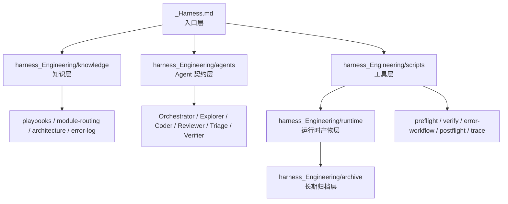
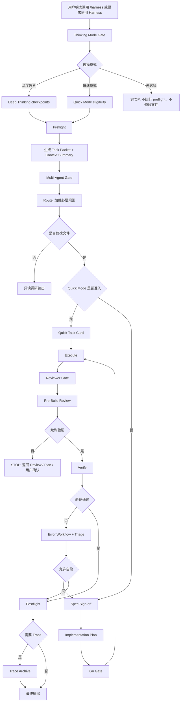
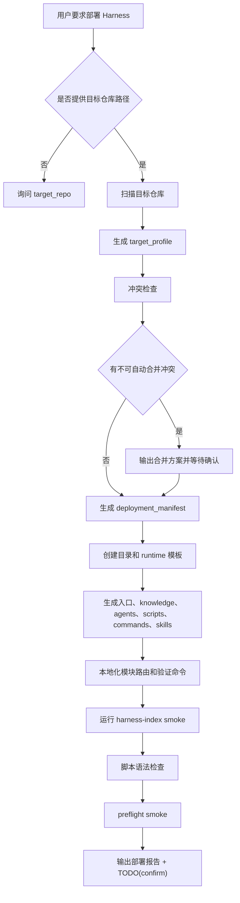
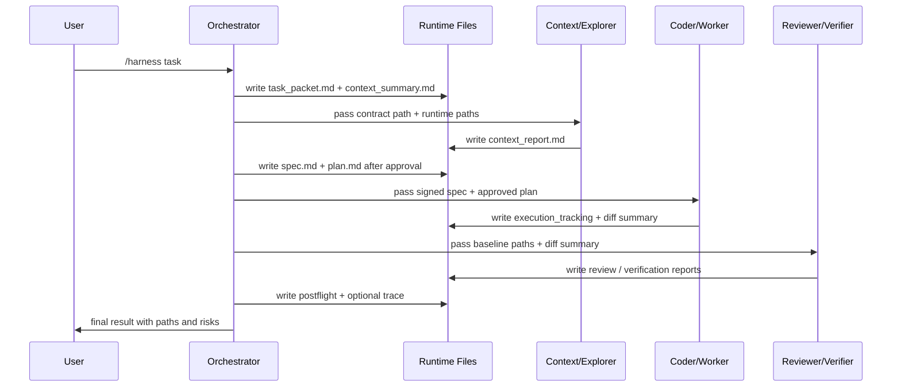

# Flow Diagrams

## Harness 分层架构

```mermaid
flowchart TD
  A["<repo>_Harness.md<br/>入口层"] --> B["harness_Engineering/knowledge<br/>知识层"]
  A --> C["harness_Engineering/agents<br/>Agent 契约层"]
  A --> D["harness_Engineering/scripts<br/>工具层"]
  D --> E["harness_Engineering/runtime<br/>运行时产物层"]
  E --> F["harness_Engineering/archive<br/>长期归档层"]
  B --> G["playbooks / module-routing / architecture / error-log"]
  C --> H["Orchestrator / Explorer / Coder / Reviewer / Triage / Verifier"]
  D --> I["preflight / verify / error-workflow / postflight / trace"]
```

## 主工作流

```mermaid
flowchart TD
  A["用户明确调用 /harness 或要求使用 Harness"] --> B["Thinking Mode Gate"]
  B --> C{"选择模式"}
  C -->|"深度思考"| D["Deep Thinking checkpoints"]
  C -->|"快速模式"| E["Quick Mode eligibility"]
  C -->|"未选择"| STOP0["STOP: 不运行 preflight，不修改文件"]
  D --> F["Preflight"]
  E --> F
  F --> G["生成 Task Packet + Context Summary"]
  G --> H["Multi-Agent Gate"]
  H --> I["Route: 加载必要规则"]
  I --> J{"是否修改文件"}
  J -->|"否"| R0["只读调研输出"]
  J -->|"是"| K{"Quick Mode 是否准入"}
  K -->|"是"| L["Quick Task Card"]
  K -->|"否"| M["Spec Sign-off"]
  M --> N["Implementation Plan"]
  N --> O["Go Gate"]
  L --> P["Execute"]
  O --> P
  P --> Q["Reviewer Gate"]
  Q --> R["Pre-Build Review"]
  R --> S{"允许验证"}
  S -->|"否"| STOP1["STOP: 返回 Review / Plan / 用户确认"]
  S -->|"是"| T["Verify"]
  T --> U{"验证通过"}
  U -->|"否"| V["Error Workflow + Triage"]
  U -->|"是"| W["Postflight"]
  V --> X{"允许自愈"}
  X -->|"是"| M
  X -->|"否"| W
  W --> Y{"需要 Trace"}
  Y -->|"是"| Z["Trace Archive"]
  Y -->|"否"| END["最终输出"]
  Z --> END
```

## 一键部署流程

```mermaid
flowchart TD
  A["用户要求部署 Harness"] --> B{"是否提供目标仓库路径"}
  B -->|"否"| C["询问 target_repo"]
  B -->|"是"| D["扫描目标仓库"]
  D --> E["生成 target_profile"]
  E --> F["冲突检查"]
  F --> G{"有不可自动合并冲突"}
  G -->|"是"| H["输出合并方案并等待确认"]
  G -->|"否"| I["生成 deployment_manifest"]
  H --> I
  I --> J["创建目录和 runtime 模板"]
  J --> K["生成入口、knowledge、agents、scripts、commands、skills"]
  K --> L["本地化模块路由和验证命令"]
  L --> M["运行 harness-index smoke"]
  M --> N["脚本语法检查"]
  N --> O["preflight smoke"]
  O --> P["输出部署报告 + TODO(confirm)"]
```

## 文件化通信协议

```mermaid
sequenceDiagram
  participant U as User
  participant O as Orchestrator
  participant R as Runtime Files
  participant E as Context/Explorer
  participant C as Coder/Worker
  participant V as Reviewer/Verifier

  U->>O: /harness task
  O->>R: write task_packet.md + context_summary.md
  O->>E: pass contract path + runtime paths
  E->>R: write context_report.md
  O->>R: write spec.md + plan.md after approval
  O->>C: pass signed spec + approved plan
  C->>R: write execution_tracking + diff summary
  O->>V: pass baseline paths + diff summary
  V->>R: write review / verification reports
  O->>R: write postflight + optional trace
  O->>U: final result with paths and risks
```
